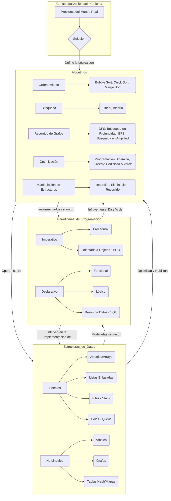
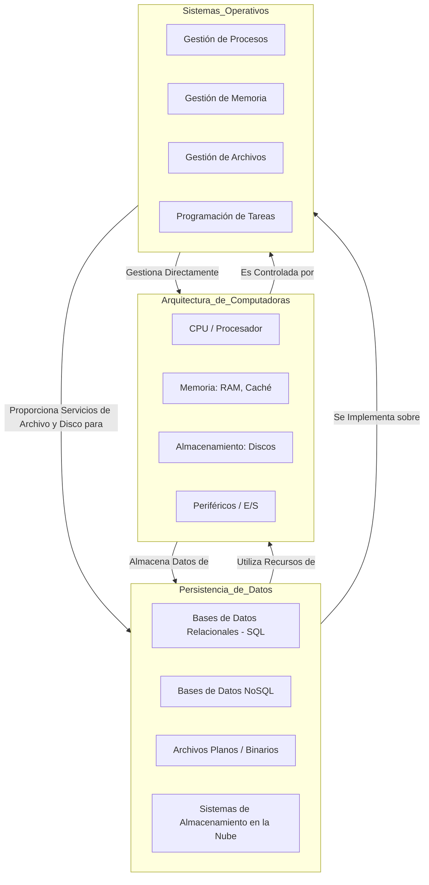

Diagrama 1

Diagrama 2

Referencias:

1. Estructuras de Datos y Algoritmos (El Corazón de la Computación)
   Estos son esenciales para el "Qué", "Cómo" profundo, "Cuándo usarlo" y la "Aplicación práctica". Son también la base de casi todas las entrevistas técnicas.

Para el "Qué", "Cómo" (profundo), "Aplicación práctica" y "Validación":

"Introduction to Algorithms" (CLRS) por Thomas H. Cormen, Charles E. Leiserson, Ronald L. Rivest, Clifford Stein.
Qué/Cómo Profundo: La Biblia de los algoritmos y estructuras de datos. Proporciona un entendimiento matemático y detallado de cómo funcionan y cómo se analizan. Ideal para la base teórica y la implementación profunda.
Aplicación Práctica: Aunque teórico, cada algoritmo tiene aplicaciones y ejemplos, lo que ayuda a entender su relevancia.
Validación: Profundiza en la corrección de algoritmos y el análisis de su complejidad.
Consideración: Es muy denso y matemático, no es para principiantes absolutos.

Para el "Qué", "Cómo" (más accesible), "Cuándo usarlo" y "Aplicación práctica":

"Grokking Algorithms" por Aditya Bhargava.
Qué/Cómo (accesible): Explicaciones muy intuitivas y visuales de algoritmos fundamentales. Perfecto para entender el "qué" y el "cómo" sin mucha matemática.
Cuándo usarlo/Aplicación Práctica: Abunda en ejemplos del mundo real y problemas prácticos que justifican el uso de cada algoritmo y estructura. Muy útil para el "cuándo".
Consideración: No tan profundo como CLRS, pero excelente para solidificar la comprensión fundamental y la intuición.

Para el "Enfoque en entrevistas" y "Aplicación práctica":

"Cracking the Coding Interview" por Gayle Laakmann McDowell.
Enfoque en Entrevistas: Es el estándar de oro para la preparación de entrevistas técnicas.
Qué/Cómo/Cuándo/Aplicación Práctica: Presenta una vasta colección de problemas de entrevistas (con soluciones) que cubren estructuras de datos y algoritmos, forzándote a aplicar los conceptos de manera práctica y a entender cuándo usar cada uno en un contexto de resolución de problemas.

2. Paradigmas de Programación y Diseño de Software
   Abordan el "Qué", "Cómo" (filosófico y de patrones), "Cuándo usarlo" y "Aplicación práctica" en la arquitectura del código.

Para el "Qué", "Cómo" (profundo y fundamental):

"Structure and Interpretation of Computer Programs" (SICP) por Harold Abelson y Gerald Jay Sussman.
Qué/Cómo Profundo: Un clásico que enseña principios fundamentales de la programación y la computación desde una perspectiva funcional y de diseño. Aborda conceptos imperativos, recursión, abstracción y más. No es un libro de "paradigma por paradigma", sino de "cómo pensar como un científico de la computación".
Consideración: Usa Scheme/Lisp, lo que puede ser una barrera inicial, pero las lecciones son atemporales y aplicables a cualquier lenguaje.

Para el "Cuándo usarlo", "Aplicación práctica" y "Cómo" (mejores prácticas):

"Design Patterns: Elements of Reusable Object-Oriented Software" por Erich Gamma et al. (Gang of Four - GoF).
Qué/Cuándo usarlo/Aplicación Práctica: Define patrones de diseño clave para la programación orientada a objetos. Te enseña a reconocer problemas comunes de diseño y a aplicar soluciones probadas, lo cual es fundamental para el "cuándo" y la "aplicación práctica" en un paradigma específico.

"Clean Code: A Handbook of Agile Software Craftsmanship" por Robert C. Martin.
Cómo (mejores prácticas): Aunque no es estrictamente sobre paradigmas, enseña cómo escribir código limpio, legible y mantenible, lo cual es aplicable a cualquier paradigma y es crucial para la "aplicación práctica" de principios sólidos de diseño.

3. Arquitectura de Computadoras
   Fundamental para entender el "Qué" y el "Cómo" a nivel de hardware, impactando el "Cuándo usarlo" para la optimización.

Para el "Qué", "Cómo" (profundo), "Aplicación práctica" (desde la perspectiva del programador):

"Computer Systems: A Programmer's Perspective" (CS:APP) por Randal E. Bryant y David R. O'Hallaron.
Qué/Cómo Profundo: Explica cómo el hardware y el sistema operativo influyen directamente en el rendimiento y comportamiento del código que escribes. Cubre desde bits hasta redes, pasando por CPU, memoria, E/S.
Aplicación Práctica: Crucial para entender por qué ciertas optimizaciones funcionan, cómo se asigna la memoria, y cómo interactúa tu programa con el sistema. Directamente relevante para escribir código eficiente.

Para el "Qué", "Cómo" (fundamentos del hardware):

"Computer Organization and Design: The Hardware/Software Interface" por David A. Patterson y John L. Hennessy.
Qué/Cómo Profundo: El libro de texto estándar para arquitectura de computadoras. Va desde la lógica digital hasta las CPUs modernas y la jerarquía de memoria. Es la base para entender cómo las instrucciones se ejecutan realmente.

4. Sistemas Operativos
   Clave para el "Qué", "Cómo" de la gestión de recursos y el "Cuándo usarlo" en sistemas complejos.

Para el "Qué", "Cómo" (profundo):
"Operating System Concepts" (conocido como el "Dinosaur Book") por Abraham Silberschatz, Peter B. Galvin, Greg Gagne.
Qué/Cómo Profundo: Un compendio exhaustivo de los principios y mecanismos de los sistemas operativos modernos: gestión de procesos, memoria, almacenamiento, E/S, seguridad, etc. Esencial para entender cómo tu software interactúa con el sistema base.

5. Persistencia de Datos (Bases de Datos y Almacenamiento)
   Importante para el "Qué", "Cómo" (modelado y acceso), y especialmente el "Cuándo usarlo" en la gestión de información.

Para el "Qué", "Cómo" (profundo) y "Cuándo usarlo" (modelos modernos):
"Designing Data-Intensive Applications" por Martin Kleppmann.
Qué/Cómo Profundo: Un libro moderno y extraordinario que explora las bases de datos (SQL y NoSQL) y los sistemas distribuidos desde una perspectiva fundamental. Cubre la consistencia, disponibilidad, tolerancia a particiones, y las compensaciones de diseño.
Cuándo usarlo/Aplicación Práctica: Excelente para entender las decisiones de arquitectura de datos y cuándo elegir un tipo de sistema de persistencia sobre otro. Vital para la aplicación práctica en sistemas actuales.

6. Validación y Calidad del Software
   Aunque no tienes un bloque específico para esto, es transversal a todos los demás conceptos.

Para "Validación" y "Aplicación práctica":
"Code Complete" por Steve McConnell.
Aplicación Práctica/Validación: Una guía exhaustiva de las mejores prácticas en la construcción de software. Incluye secciones detalladas sobre depuración, pruebas unitarias, integración y técnicas para escribir código robusto y menos propenso a errores. Es un libro de "cómo hacer las cosas bien" en el día a día.

"The Pragmatic Programmer" (Andrew Hunt, David Thomas): Aunque más general, ofrece principios atemporales para ser un desarrollador efectivo y práctico.

<!-- end list -->

## Licencia

Este contenido (incluyendo los diagramas) está bajo la licencia [Creative Commons Atribución-NoComercial 4.0 Internacional](https://creativecommons.org/licenses/by-nc/4.0/).
