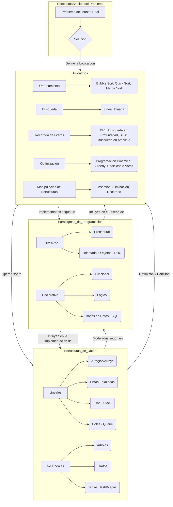
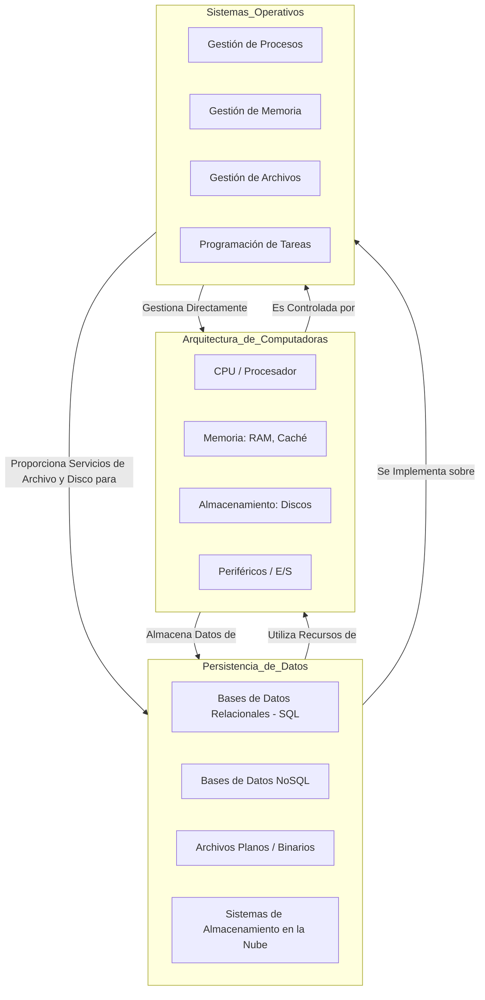

# Handbook for Software Development

Este **Handbook for Software Development** es una guía visual concisa y práctica, que desglosa los pilares esenciales para el desarrollo de software.

## Propósito

Este handbook está diseñado para ser una **referencia rápida y efectiva**, facilitando la comprensión, el repaso y la aplicación práctica de conceptos complejos. Su formato permite una asimilación ágil de la información, ideal para preparar entrevistas técnicas, reforzar conocimientos o simplemente tener una guía a mano durante el desarrollo.

---

Diagrama 1

Diagrama 2

---

## Referencias para Profundizar

Para quienes deseen explorar a fondo los conceptos presentados en este Handbook, a continuación, se listan los libros fundamentales que sirvieron de base para una comprensión integral del "Qué", el "Cómo" (profundo), el "Cuándo usarlo", la aplicación práctica, la validación y la preparación para entrevistas.

### Estructuras de Datos y Algoritmos (El Corazón de la Computación)

Estos libros son esenciales para la base teórica y práctica de la computación, fundamentales para entrevistas técnicas.

- **"Introduction to Algorithms" (CLRS)** por Thomas H. Cormen, Charles E. Leiserson, Ronald L. Rivest, Clifford Stein.

  - **Ideal para:** Comprender el **"Qué"** y el **"Cómo"** a un nivel profundo y matemático. Explora la **validación** y análisis de complejidad de algoritmos. Es la "Biblia" académica.
  - **Consideración:** Muy denso, recomendado para quienes buscan un estudio riguroso.

- **"Grokking Algorithms"** por Aditya Bhargava.

  - **Ideal para:** Entender el **"Qué"** y el **"Cómo"** de forma accesible e intuitiva. Ofrece ejemplos claros para saber **"Cuándo usarlo"** y su **aplicación práctica**.
  - **Consideración:** Excelente punto de partida para conceptos fundamentales sin matemática excesiva.

- **"Cracking the Coding Interview"** por Gayle Laakmann McDowell.
  - **Ideal para:** Preparación de **entrevistas técnicas**. Ofrece una amplia colección de problemas y soluciones para la **aplicación práctica** de algoritmos y estructuras de datos en escenarios de entrevistas.

### Paradigmas de Programación y Diseño de Software

Estos recursos abordan el "Qué", "Cómo" y "Cuándo usarlo" en la arquitectura y escritura de código.

- **"Structure and Interpretation of Computer Programs" (SICP)** por Harold Abelson y Gerald Jay Sussman.

  - **Ideal para:** Profundizar en el **"Qué"** y **"Cómo"** fundamental de la programación y el diseño desde una perspectiva computacional.
  - **Consideración:** Clásico que enseña principios atemporales, usando Scheme/Lisp como vehículo.

- **"Design Patterns: Elements of Reusable Object-Oriented Software"** por Erich Gamma et al. (Gang of Four - GoF).

  - **Ideal para:** Conocer el **"Qué"** de los patrones de diseño, **"Cuándo usarlos"** y su **aplicación práctica** en la programación orientada a objetos para soluciones de diseño reutilizables.

- **"Clean Code: A Handbook of Agile Software Craftsmanship"** por Robert C. Martin.
  - **Ideal para:** Aprender el **"Cómo"** (mejores prácticas) para escribir código limpio, legible y mantenible, lo cual es aplicable a cualquier paradigma y es crucial para la **aplicación práctica** de principios de diseño sólidos.

### Arquitectura de Computadoras

Fundamental para entender el "Qué" y el "Cómo" a nivel de hardware y su impacto en el software.

- **"Computer Systems: A Programmer's Perspective" (CS:APP)** por Randal E. Bryant y David R. O'Hallaron.

  - **Ideal para:** Comprender el **"Qué"** y el **"Cómo"** profundo de la interacción hardware-software, y su **aplicación práctica** en la optimización del rendimiento del código.

- **"Computer Organization and Design: The Hardware/Software Interface"** por David A. Patterson y John L. Hennessy.
  - **Ideal para:** Entender el **"Qué"** y **"Cómo"** fundamental del hardware, desde la lógica digital hasta la organización de la CPU y la memoria.

### Sistemas Operativos

Clave para el "Qué" y el "Cómo" de la gestión de recursos a bajo nivel.

- **"Operating System Concepts"** (el "Dinosaur Book") por Abraham Silberschatz, Peter B. Galvin, Greg Gagne.
  - **Ideal para:** Un compendio exhaustivo del **"Qué"** y el **"Cómo"** de los sistemas operativos modernos, incluyendo gestión de procesos, memoria, almacenamiento y E/S.

### Persistencia de Datos (Bases de Datos y Almacenamiento)

Importante para el "Qué", "Cómo" y, crucialmente, el "Cuándo usarlo" en la gestión de información.

- **"Designing Data-Intensive Applications"** por Martin Kleppmann.
  - **Ideal para:** Entender el **"Qué"** y el **"Cómo"** de las bases de datos (SQL y NoSQL) y sistemas distribuidos. Excelente para las decisiones de **"Cuándo usarlo"** en la **aplicación práctica** de arquitecturas de datos modernas.

### Validación y Calidad del Software (Transversal)

Estos libros abordan las mejores prácticas para asegurar la robustez y calidad del software.

- **"Code Complete"** por Steve McConnell.

  - **Ideal para:** Una guía exhaustiva de **"Cómo"** construir software de calidad, enfocada en la **validación** (pruebas, depuración) y **aplicación práctica** de técnicas para un código robusto.

- **"The Pragmatic Programmer"** por Andrew Hunt y David Thomas.
  - **Ideal para:** Ofrece principios atemporales y prácticos sobre **"Cómo"** ser un desarrollador efectivo, que abarca desde la ética profesional hasta técnicas de **validación** y **aplicación práctica** en el día a día.

---

## Licencia

Todo el contenido de este repositorio está disponible bajo la licencia [Creative Commons Atribución-NoComercial-CompartirIgual 4.0 Internacional (CC BY-NC-SA 4.0)](https://creativecommons.org/licenses/by-nc-sa/4.0/). Esto significa que eres libre de usar, compartir y adaptar este material para fines no comerciales, siempre y cuando des la atribución adecuada y cualquier obra derivada se distribuya bajo la misma licencia.
